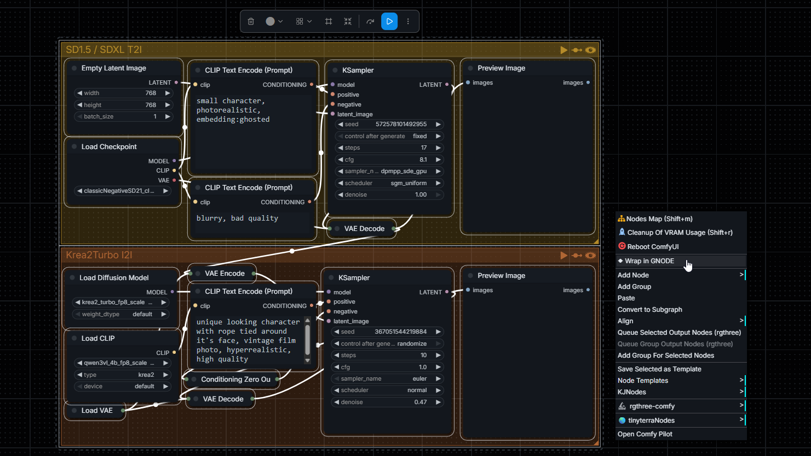
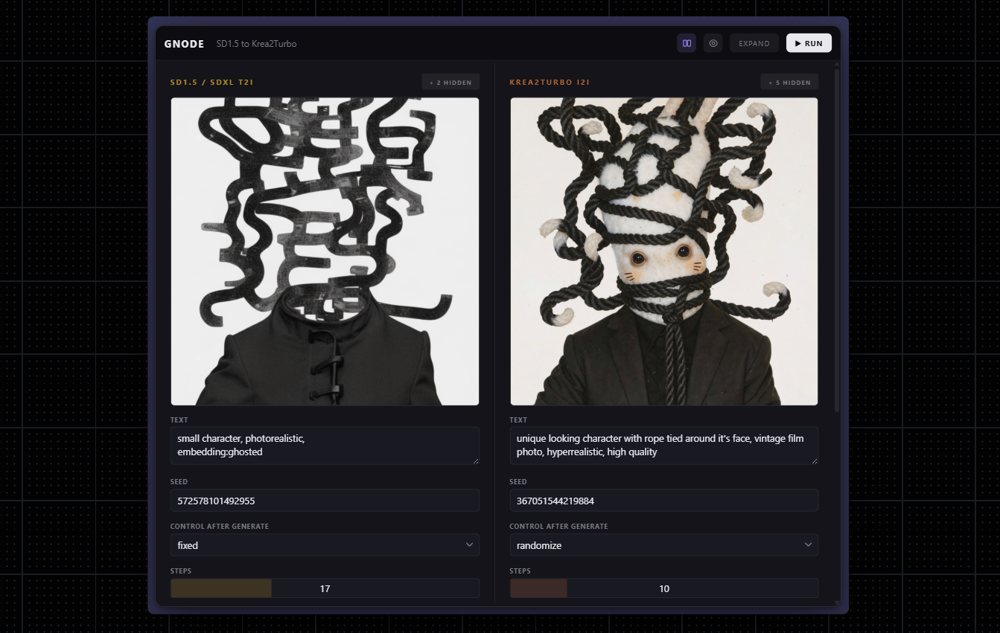

# GNODE

A frontend-only ComfyUI extension that collapses a cluster of nodes into a single clean card in-place of the cluster. Cleaner than subgraphs — no nesting, no black box — your underlying graph is unchanged.

Select any set of nodes, right-click → **⧉ CREATE GNODE**, and get one grouped card exposing just the parameters and previews you care about. Restore the original layout any time with **EXPAND**.



## Install

**Comfy Registry** (recommended)
```bash
comfy node install gnode
```

**ComfyUI Manager**: search for `gnode`.

**Manual**
```bash
cd ComfyUI/custom_nodes
git clone https://github.com/spiritform/gnode
```

Restart ComfyUI. No dependencies, frontend-only.

## Usage

Select any nodes and right-click → **⧉ CREATE GNODE**:



- **Create**: select 2+ nodes → right-click → `⧉ CREATE GNODE`. LiteGraph groups become section headers automatically; ungrouped nodes fall into a Misc section.
- **Expand**: click **EXPAND** on the card to restore original positions and groups.
- **Send to GNODE**: right-click any loose node → `⧉ Send to GNODE ▸ <section>` (existing sections + `+ new section…`).
- **Hide / restore parameters**: hover a row and click the `×`. Restore from the per-section `+ N hidden` popover.
- **Reorder**: drag any row (including preview rows) up or down within or across sections. Reorder columns via the `◀ ▶` chevrons on section headers.
- **Add empty column**: click the `+` icon in the card header to append a fresh column. Drag widgets into it from any other column to build your own grouping.
- **Group elements**: hover a section header and click `+` to insert a **Header** label or a **Divider** line. Both are draggable, renamable (double-click headers), and deletable with `×`.
- **Rename any header**: double-click the section title (WIDGETS, NEW, …) or the LOAD IMAGE / PREVIEW column headers to rename them inline.
- **Preview column**: click the eye icon in the header to show a right-side thumb column for all preview nodes.
- **Load Image inputs**: double-click the thumb or drag-drop an image file to upload directly into the underlying `LoadImage` node.
- **Value scrub**: click-drag horizontally on a value box (including unbounded ones like `seed`). `Shift` = fine (0.1×), `Ctrl` = coarse (10×). Double-click to type an exact value.

## Features

- Two-way widget mirroring (combos, sliders, textareas, toggles, checkboxes)
- Combo dropdowns handle subfolder paths (`flux/lora.safetensors`) and lazily-loaded model lists
- Preview rows update after each run via `app.nodeOutputs`
- Executing pulse: the active section header glows while its nodes are running
- Random Comfy-native accent color per GNODE (persists across reloads)
- Empty columns + subheader / divider elements let you author your own layout inside a card
- Cross-column widget drag with no duplication — a widget always lives in exactly one column
- Per-section resize handles for input / preview / body widths
- Auto-fit height + width; drag the corner wider or shorter (with scrollbar) when you want
- All parameters live as cell rows — full-width value boxes, controls hover-reveal in the gutter

## License

MIT
